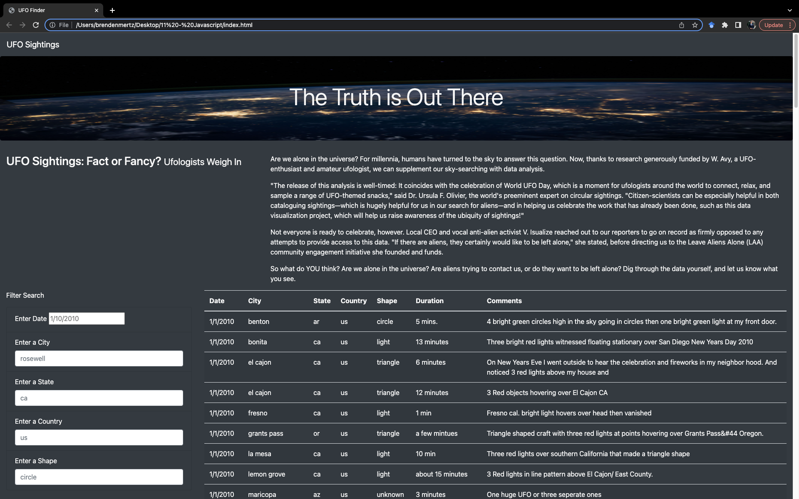

# UFOs

## Overview

Create/develop a website to analyze UFO sightings within the United States. Users are able to filter on multiple criteria.

## Results 

The website shown below was created as a result of this project. 

The Date can be filtered independently as shown below. In fact, all filters can be used independently. 

In the image below, multiple filters were applied:

## Summary

### Drawback
The main drawback to this webpage is that the filters are case sensitive. You must type in the filterable ID exactly as it is written in the table. 

### Recommendations
1. Enhance the filters to avoid case sensitivity. For example, allow "California" to be typed instead of just "ca".
2. Build a drop down list instead of a filter for States and Cities so that there is no ambiguity in search criterian. 

* Note: Deliverable 2 is this ReadMe File.
